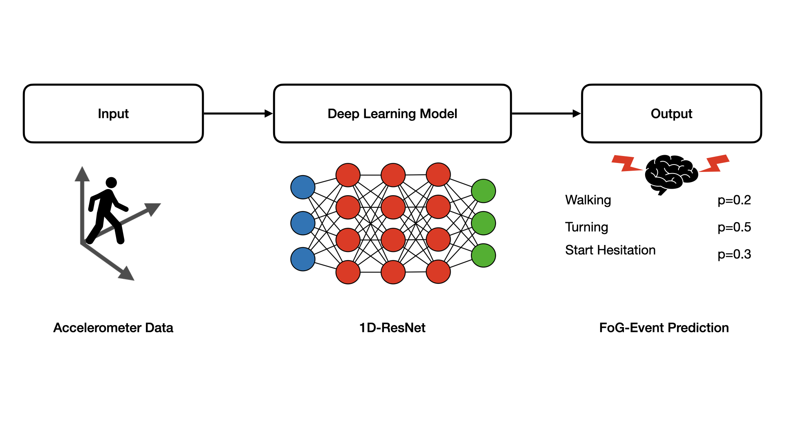

# 1D-ResNet Ensemble for Freezing of Gait Prediction Trained on Data Collected From a Wearable 3D Lower Back Sensor


<br /><br />This repository is home to the source code for the results reported in

[Freezing of Gait Prediction From Accelerometer Data Using a Simple 1D-Convolutional Neural Network -- 8th Place Solution for Kaggle's Parkinson's Freezing of Gait Prediction Competition
](https://arxiv.org/abs/2307.03475).

The paper presents a Deep-Learning based approach to detecting Freezing of Gait (FOG) in accelerometer data.


## Requirements

#### Inference and Evaluation

A standard computer with enough RAM is required for inference and evaluation.

#### Training

For training, an NVIDIA GPU with > 10 GB VRAM is recommended. The algorithm was developed on an NVIDIA RTX3060 with 12 GB of VRAM. Model training  took ~5 hours. As Pytorch's automatic mixed precision feature was utilized, the training code can not be
run on a CPU / Mac while inference and evaluation work on these systems without modifications. 


## Installation
```sh
# install pytorch
conda install pytorch torchvision torchaudio pytorch-cuda=11.7 -c pytorch -c nvidia
```
```sh
# clone repository
$ git clone https://github.com/janbrederecke/fog
```
```sh
# install requirements
$ cd fog
$ pip install -r requirements.txt
```


## Inference

Results will be saved as `results.csv` in `./`.

Rough values are returned, as calculation of the competition metrics did not
rely on probabilities. You could use a sigmoid function to make them more human
readable.

#### Run inference using the models from the Kaggle competition

Download the [weights](https://www.kaggle.com/datasets/janbrederecke/fog-final-models) and put them in `./weights/FoG/`.

Execute the following code:

```sh
$ python main.py inference kaggle_models
```

#### Run inference using your self-trained models

Train your own models using the included `train` argument described below.

Execute the following code:

```sh
$ python main.py inference
````


Inference is currently set up to be run on the example data provided in `/data/test/`.

####  Run inference on your own data
##### Either
Your data is saved as a .csv file and follows the format (see below) of the deFOG data and is located at `./data/test/defog`.

Every recorded session is saved as an individual .csv file.

```sh
Time,AccV,AccML,AccAP,StartHesitation,Turn,Walking,Valid,Task
0,-1.01730346044636,0.105947677733569,-0.0671944702082652,0,0,0,false,false
1,-1.01997198880408,0.105368755184179,-0.0689203630006303,0,0,0,false,false
2,-1.01794234301126,0.103586433290663,-0.0694099738857769,0,0,0,false,false
```
- <b>Time</b>: An integer timestep, series from the deFOG dataset are recorded at 100 Hz
- <b>AccV, AccML, and AccAP</b>: Acceleration from a lower-back sensor on three axes: V - vertical, ML - mediolateral, AP - anteroposterior. Data is in units of g for deFOG.
- <b>StartHesitation, Turn, Walking</b>: Indicator variables for the occurrence of each of the event types.
- <b>Valid</b>: There were cases during the video annotation that were hard for the annotator to decide if there was an akinetic (i.e., essentially no movement) FoG or the subject stopped voluntarily. Only event annotations where the series is marked true should be considered as unambiguous.
- <b>Task</b>: Series were only annotated where this value is true. Portions marked false should be considered unannotated.

##### Or
Your data is saved as a .csv follows the format (see below) of the tdcs FOG data and is located at `./data/test/tdcsfog`.

Every recorded session is saved as an individual .csv file.

```sh
Time,AccV,AccML,AccAP,StartHesitation,Turn,Walking
0,-9.49559221912324,-0.906945044395018,-0.336842987439936,0,0,0
1,-9.48801268356261,-0.899194900216428,-0.337949687012932,0,0,0
2,-9.492908192609,-0.904170188891895,-0.343040653636143,0,0,0
```
- <b>Time</b>: An integer timestep, series from the tdcs FOG dataset are recorded at 128 Hz
- <b>AccV, AccML, and AccAP</b>: Acceleration from a lower-back sensor on three axes: V - vertical, ML - mediolateral, AP - anteroposterior. Data is in units of m/s^2 for tdcsfog.
- <b>StartHesitation, Turn, Walking</b>: Indicator variables for the occurrence of each of the event types.

More specific information on the formatting requirements is provided through the competition pages on [Kaggle](https://www.kaggle.com/competitions/tlvmc-parkinsons-freezing-gait-prediction/data).


## Training
Download the [competition data](https://www.kaggle.com/competitions/tlvmc-parkinsons-freezing-gait-prediction/data) from Kaggle preferably using the [Kaggle API](https://www.kaggle.com/docs/api).

Place the `defog` and `tdcsfog` folders in `./data/train/`.

Place the metadata files for `defog` and `tdcsfog` in `./data/`.

Run training. 
```sh
$ python main.py train
```

Model weights will be saved at `./weights/FoG/`.

## Evaluation
Results of the evaluation will be printed to the console and saved in `./weights/FoG/`.

#### Calculate Evaluation Metrics for the Original Kaggle Models
```sh
$ python main.py evaluation kaggle_models
```
#### Calculate Evaluation Metrics for Newly Trained Models
```sh
$ python main.py evaluation 
```